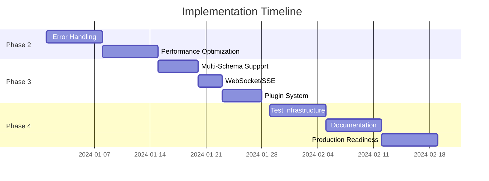

# Implementation Roadmap

## Week 1-2: Reliability & Error Handling

### Goals
- Zero crashes during 48-hour continuous watch mode
- Clear, actionable error messages
- Graceful degradation on failures

### Tasks

#### 1.1 Smart Retry Strategy (2 days)
```typescript
// Implementation plan
interface RetryStrategy {
  shouldRetry(error: Error, attempt: number): boolean;
  getDelay(attempt: number): number;
  onSuccess(): void;
  onFailure(error: Error): void;
}

class ExponentialBackoffStrategy implements RetryStrategy {
  private baseDelay = 1000;
  private maxDelay = 30000;
  private jitter = true;
  
  getDelay(attempt: number): number {
    const exponentialDelay = Math.min(
      this.baseDelay * Math.pow(2, attempt),
      this.maxDelay
    );
    
    if (this.jitter) {
      // Add 0-25% random jitter to prevent thundering herd
      return exponentialDelay * (1 + Math.random() * 0.25);
    }
    
    return exponentialDelay;
  }
}
```

**Acceptance Criteria:**
- [ ] Exponential backoff with configurable base/max delay
- [ ] Jitter to prevent synchronized retries
- [ ] Different strategies for network vs parse errors
- [ ] Circuit breaker after N consecutive failures

#### 1.2 Enhanced Error Messages (2 days)

```typescript
// Before
throw new Error('Failed to parse schema');

// After
throw new SchemaParseError({
  message: 'Failed to parse OpenAPI schema',
  detail: 'Unexpected token at line 45, column 12',
  suggestion: 'Check for missing commas or quotes in your JSON',
  schemaPath: '/components/schemas/User',
  documentationUrl: 'https://oats.dev/errors/schema-parse'
});
```

**Error Categories:**
- Network errors (connection, timeout, DNS)
- Schema errors (invalid format, missing required fields)
- Generation errors (unsupported features, naming conflicts)
- File system errors (permissions, disk space)
- Configuration errors (invalid options, missing config)

#### 1.3 Validation Cache & Debug Mode (1 day)

```typescript
class ValidationCache {
  private lastValidSchema: OpenAPISchema | null = null;
  private validationErrors: ValidationError[] = [];
  
  async validateWithCache(schema: OpenAPISchema): Promise<ValidationResult> {
    const result = await validate(schema);
    
    if (result.valid) {
      this.lastValidSchema = schema;
      this.validationErrors = [];
    } else {
      // Show what changed since last valid schema
      if (this.lastValidSchema && debugMode) {
        const diff = generateDiff(this.lastValidSchema, schema);
        console.log('Schema changes since last valid state:', diff);
      }
      this.validationErrors = result.errors;
    }
    
    return result;
  }
}
```

#### 1.4 Health Check Endpoint (1 day)

```typescript
// Add health check for watch mode
class HealthMonitor {
  private lastSuccessfulGeneration: Date | null = null;
  private totalGenerations = 0;
  private failedGenerations = 0;
  
  getHealth(): HealthStatus {
    return {
      status: this.failedGenerations > 5 ? 'unhealthy' : 'healthy',
      lastSuccess: this.lastSuccessfulGeneration,
      successRate: this.totalGenerations > 0 
        ? (this.totalGenerations - this.failedGenerations) / this.totalGenerations 
        : 0,
      uptime: process.uptime()
    };
  }
}

// Expose via HTTP endpoint for monitoring
app.get('/.well-known/oats-health', (req, res) => {
  res.json(healthMonitor.getHealth());
});
```

### Testing Requirements
- [ ] 48-hour soak test with random network failures
- [ ] Schema corruption recovery test
- [ ] Memory leak detection over 1000 generations
- [ ] Error message clarity user testing

## Week 3-4: Performance Optimization

### Goals
- <100ms generation for unchanged schemas
- <500ms for small changes in large schemas
- <2GB memory usage for any schema size

### Tasks

#### 2.1 Incremental Generation (3 days)

```typescript
class IncrementalGenerator {
  private schemaCache = new Map<string, GeneratedSection>();
  
  async generate(schema: OpenAPISchema): Promise<string> {
    const sections = this.splitIntoSections(schema);
    const results: GeneratedSection[] = [];
    
    for (const section of sections) {
      const hash = this.hashSection(section);
      
      if (this.schemaCache.has(hash)) {
        // Reuse cached generation
        results.push(this.schemaCache.get(hash)!);
      } else {
        // Generate only this section
        const generated = await this.generateSection(section);
        this.schemaCache.set(hash, generated);
        results.push(generated);
      }
    }
    
    return this.combineGeneratedSections(results);
  }
  
  private splitIntoSections(schema: OpenAPISchema): SchemaSection[] {
    // Split by:
    // 1. Individual paths
    // 2. Individual component schemas
    // 3. Shared types
    return [
      ...this.extractPaths(schema),
      ...this.extractComponents(schema),
      this.extractSharedTypes(schema)
    ];
  }
}
```

**Optimization Targets:**
- Path-level caching (each endpoint independently)
- Component-level caching (each schema independently)
- Import deduplication
- Parallel generation for independent sections

#### 2.2 Worker Thread Generation (2 days)

```typescript
// Main thread
class WorkerGenerator {
  private worker: Worker;
  private queue: GenerationTask[] = [];
  
  constructor() {
    this.worker = new Worker('./generation-worker.js');
    this.worker.on('message', this.handleResult.bind(this));
  }
  
  async generate(schema: OpenAPISchema): Promise<string> {
    return new Promise((resolve, reject) => {
      const task = { id: uuid(), schema, resolve, reject };
      this.queue.push(task);
      this.worker.postMessage({ type: 'generate', task });
    });
  }
}

// Worker thread (generation-worker.js)
parentPort.on('message', async ({ type, task }) => {
  if (type === 'generate') {
    try {
      const result = await generateTypes(task.schema);
      parentPort.postMessage({ 
        type: 'result', 
        taskId: task.id, 
        result 
      });
    } catch (error) {
      parentPort.postMessage({ 
        type: 'error', 
        taskId: task.id, 
        error: error.message 
      });
    }
  }
});
```

#### 2.3 Memory-Efficient Streaming (2 days)

```typescript
class StreamingGenerator {
  async *generateStream(schema: OpenAPISchema): AsyncGenerator<string> {
    // Generate header
    yield '// Auto-generated by @oats/gen\n\n';
    
    // Stream paths one by one
    for (const [path, methods] of Object.entries(schema.paths || {})) {
      yield await this.generatePath(path, methods);
      
      // Allow GC to clean up after each path
      await new Promise(resolve => setImmediate(resolve));
    }
    
    // Stream components
    for (const [name, component] of Object.entries(schema.components?.schemas || {})) {
      yield await this.generateComponent(name, component);
      
      // Yield control periodically
      await new Promise(resolve => setImmediate(resolve));
    }
    
    // Generate helpers at the end
    yield this.generateHelpers();
  }
  
  async generateToFile(schema: OpenAPISchema, outputPath: string): Promise<void> {
    const writeStream = createWriteStream(outputPath);
    
    for await (const chunk of this.generateStream(schema)) {
      writeStream.write(chunk);
    }
    
    await new Promise(resolve => writeStream.end(resolve));
  }
}
```

#### 2.4 LRU Cache Implementation (1 day)

```typescript
class LRUCache<K, V> {
  private maxSize: number;
  private cache = new Map<K, V>();
  
  constructor(maxSize: number = 100) {
    this.maxSize = maxSize;
  }
  
  get(key: K): V | undefined {
    const value = this.cache.get(key);
    if (value !== undefined) {
      // Move to end (most recently used)
      this.cache.delete(key);
      this.cache.set(key, value);
    }
    return value;
  }
  
  set(key: K, value: V): void {
    // Remove oldest if at capacity
    if (this.cache.size >= this.maxSize && !this.cache.has(key)) {
      const firstKey = this.cache.keys().next().value;
      this.cache.delete(firstKey);
    }
    
    // Remove and re-add to move to end
    this.cache.delete(key);
    this.cache.set(key, value);
  }
  
  clear(): void {
    this.cache.clear();
  }
  
  get size(): number {
    return this.cache.size;
  }
}

// Use in generator
class CachedGenerator {
  private pathCache = new LRUCache<string, string>(1000);
  private schemaCache = new LRUCache<string, string>(500);
  
  async generatePath(path: string, definition: any): Promise<string> {
    const cacheKey = JSON.stringify({ path, definition });
    
    const cached = this.pathCache.get(cacheKey);
    if (cached) return cached;
    
    const generated = await this.doGeneratePath(path, definition);
    this.pathCache.set(cacheKey, generated);
    
    return generated;
  }
}
```

### Performance Benchmarks

```typescript
// Benchmark suite
const benchmarks = [
  {
    name: 'Small API (10 endpoints)',
    schema: () => generateSchema(10),
    target: 50, // ms
    memory: 50 // MB
  },
  {
    name: 'Medium API (100 endpoints)',
    schema: () => generateSchema(100),
    target: 200,
    memory: 100
  },
  {
    name: 'Large API (1000 endpoints)',
    schema: () => generateSchema(1000),
    target: 2000,
    memory: 500
  },
  {
    name: 'Incremental change (1 endpoint in 1000)',
    schema: () => generateSchemaWithChange(1000, 1),
    target: 100,
    memory: 100
  }
];

// Run benchmarks
for (const benchmark of benchmarks) {
  const start = performance.now();
  const initialMemory = process.memoryUsage().heapUsed;
  
  await generator.generate(benchmark.schema());
  
  const duration = performance.now() - start;
  const memoryUsed = (process.memoryUsage().heapUsed - initialMemory) / 1024 / 1024;
  
  console.log(`${benchmark.name}:`);
  console.log(`  Time: ${duration.toFixed(2)}ms (target: ${benchmark.target}ms)`);
  console.log(`  Memory: ${memoryUsed.toFixed(2)}MB (target: ${benchmark.memory}MB)`);
  console.log(`  Status: ${duration <= benchmark.target ? '✅' : '❌'}`);
}
```

## Week 5-6: Multi-Schema & Advanced Features

### Goals
- Support for multiple simultaneous schemas
- WebSocket/SSE for real-time updates
- Basic plugin system

### Tasks

#### 3.1 Multi-Schema Architecture (3 days)

```typescript
// Configuration
interface MultiSchemaConfig {
  schemas: SchemaConfig[];
  compose?: boolean;
  federation?: boolean;
}

interface SchemaConfig {
  name: string;
  url: string;
  output: string;
  watch?: boolean;
  interval?: number;
  transform?: (schema: OpenAPISchema) => OpenAPISchema;
}

// Implementation
class MultiSchemaWatcher {
  private watchers = new Map<string, SchemaWatcher>();
  
  async start(config: MultiSchemaConfig): Promise<void> {
    // Create watcher for each schema
    for (const schemaConfig of config.schemas) {
      const watcher = new SchemaWatcher(schemaConfig);
      
      watcher.on('generated', (event) => {
        this.handleGeneration(schemaConfig.name, event);
      });
      
      this.watchers.set(schemaConfig.name, watcher);
      await watcher.start();
    }
    
    if (config.compose) {
      await this.composeSchemas();
    }
    
    if (config.federation) {
      await this.generateFederationIndex();
    }
  }
  
  private async composeSchemas(): Promise<void> {
    const composed = new ComposedSchema();
    
    for (const [name, watcher] of this.watchers) {
      const schema = await watcher.getSchema();
      composed.addSchema(name, schema);
    }
    
    const merged = composed.merge();
    await this.generateTypes(merged);
  }
  
  private async generateFederationIndex(): Promise<void> {
    const indexContent = Array.from(this.watchers.keys())
      .map(name => `export * as ${name} from './${name}.types';`)
      .join('\n');
    
    await writeFile('src/api/index.ts', indexContent);
  }
}
```

#### 3.2 WebSocket Support (2 days)

```typescript
import WebSocket from 'ws';

class WebSocketWatcher extends EventEmitter {
  private ws: WebSocket | null = null;
  private reconnectAttempts = 0;
  private maxReconnectAttempts = 10;
  private reconnectDelay = 1000;
  
  connect(url: string): void {
    const wsUrl = url.replace('http://', 'ws://').replace('https://', 'wss://');
    
    this.ws = new WebSocket(`${wsUrl}/schema-updates`);
    
    this.ws.on('open', () => {
      console.log('Connected to schema update stream');
      this.reconnectAttempts = 0;
      
      // Subscribe to schema changes
      this.ws?.send(JSON.stringify({ 
        type: 'subscribe', 
        schemas: ['*'] 
      }));
    });
    
    this.ws.on('message', (data) => {
      const message = JSON.parse(data.toString());
      
      if (message.type === 'schema-updated') {
        this.emit('schema-change', message.schema);
        this.regenerateTypes(message.schema);
      }
    });
    
    this.ws.on('close', () => {
      this.handleDisconnect();
    });
    
    this.ws.on('error', (error) => {
      console.error('WebSocket error:', error);
      this.handleDisconnect();
    });
  }
  
  private handleDisconnect(): void {
    if (this.reconnectAttempts < this.maxReconnectAttempts) {
      const delay = this.reconnectDelay * Math.pow(2, this.reconnectAttempts);
      console.log(`Reconnecting in ${delay}ms...`);
      
      setTimeout(() => {
        this.reconnectAttempts++;
        this.connect(this.url);
      }, delay);
    } else {
      console.error('Max reconnection attempts reached');
      this.emit('connection-lost');
    }
  }
}

// Server-Sent Events alternative
class SSEWatcher extends EventEmitter {
  private eventSource: EventSource | null = null;
  
  connect(url: string): void {
    this.eventSource = new EventSource(`${url}/schema-events`);
    
    this.eventSource.onmessage = (event) => {
      const data = JSON.parse(event.data);
      
      if (data.type === 'schema-updated') {
        this.emit('schema-change', data);
        this.regenerateTypes();
      }
    };
    
    this.eventSource.onerror = (error) => {
      console.error('SSE connection error:', error);
      // EventSource automatically reconnects
    };
    
    // Custom event types
    this.eventSource.addEventListener('schema-deleted', (event) => {
      const data = JSON.parse(event.data);
      this.handleSchemaDeletion(data);
    });
  }
}
```

#### 3.3 Plugin System Foundation (3 days)

```typescript
// Plugin interface
interface OatsPlugin {
  name: string;
  version: string;
  
  // Lifecycle hooks
  onInit?(config: Config): Promise<void>;
  onDestroy?(): Promise<void>;
  
  // Schema hooks
  beforeFetch?(url: string): Promise<string | void>;
  afterFetch?(schema: OpenAPISchema): Promise<OpenAPISchema | void>;
  
  // Generation hooks
  beforeGenerate?(schema: OpenAPISchema): Promise<OpenAPISchema | void>;
  transformTypes?(types: string, schema: OpenAPISchema): Promise<string>;
  afterGenerate?(types: string): Promise<string | void>;
  
  // Watch hooks
  onWatchStart?(): void;
  onWatchStop?(): void;
  onSchemaChange?(event: SchemaChangeEvent): void;
  
  // Error hooks
  onError?(error: Error): void;
}

// Plugin manager
class PluginManager {
  private plugins: OatsPlugin[] = [];
  
  async loadPlugin(pluginPath: string): Promise<void> {
    const plugin = await import(pluginPath);
    
    if (!plugin.name || !plugin.version) {
      throw new Error(`Invalid plugin: ${pluginPath}`);
    }
    
    this.plugins.push(plugin);
    
    if (plugin.onInit) {
      await plugin.onInit(this.config);
    }
  }
  
  async runHook<T>(
    hookName: keyof OatsPlugin,
    arg: T
  ): Promise<T> {
    let result = arg;
    
    for (const plugin of this.plugins) {
      const hook = plugin[hookName] as any;
      
      if (typeof hook === 'function') {
        const hookResult = await hook.call(plugin, result);
        
        if (hookResult !== undefined) {
          result = hookResult;
        }
      }
    }
    
    return result;
  }
}

// Example plugin: Mock data generator
const mockDataPlugin: OatsPlugin = {
  name: '@oats/plugin-mock-data',
  version: '1.0.0',
  
  async afterGenerate(types: string): Promise<string> {
    // Parse the types and generate mock data functions
    const mockFunctions = generateMockFunctions(types);
    
    return `${types}\n\n// Mock Data Functions\n${mockFunctions}`;
  }
};

// Example plugin: API client generator
const apiClientPlugin: OatsPlugin = {
  name: '@oats/plugin-api-client',
  version: '1.0.0',
  
  async afterGenerate(types: string, schema: OpenAPISchema): Promise<string> {
    const client = generateApiClient(schema);
    
    return `${types}\n\n// Generated API Client\n${client}`;
  }
};
```

## Month 2: Production Readiness

### Goals
- Enterprise-scale performance
- Comprehensive testing
- Documentation and examples

### Tasks

#### 4.1 Test Infrastructure (1 week)

```typescript
// E2E test setup
describe('Watch Mode E2E', () => {
  let testServer: TestAPIServer;
  let watcher: SchemaWatcher;
  
  beforeEach(async () => {
    testServer = await TestAPIServer.start();
    watcher = new SchemaWatcher({
      schema: testServer.schemaUrl,
      output: 'test-output/types.ts'
    });
  });
  
  afterEach(async () => {
    await watcher.stop();
    await testServer.stop();
  });
  
  test('regenerates on schema change', async () => {
    await watcher.start();
    
    // Wait for initial generation
    await waitForFile('test-output/types.ts');
    const initial = await readFile('test-output/types.ts');
    
    // Change schema
    await testServer.addEndpoint('/new-endpoint');
    
    // Wait for regeneration
    await waitForFileChange('test-output/types.ts', initial);
    
    const updated = await readFile('test-output/types.ts');
    expect(updated).toContain('"/new-endpoint"');
  });
  
  test('handles connection failures gracefully', async () => {
    await watcher.start();
    
    // Simulate network failure
    await testServer.simulateNetworkFailure();
    
    // Should not crash
    await sleep(5000);
    expect(watcher.isRunning()).toBe(true);
    
    // Should recover when connection restored
    await testServer.restore();
    await testServer.addEndpoint('/recovery-test');
    
    await waitForFileContent('test-output/types.ts', '/recovery-test');
  });
});
```

#### 4.2 Documentation Suite (1 week)

1. **API Documentation**
   - Full API reference with TypeDoc
   - Plugin development guide
   - Configuration reference

2. **Tutorials**
   - Getting started video
   - Integration guides for each framework
   - Migration guide from other tools

3. **Examples Repository**
   - Next.js + Django example
   - Vue + FastAPI example
   - React Native + Express example
   - Microservices federation example

4. **Troubleshooting Guide**
   - Common errors and solutions
   - Performance tuning guide
   - Debug mode usage

## Success Criteria

### Week 1-2 Deliverables
- [ ] Zero crashes in 48-hour test
- [ ] All errors have actionable messages
- [ ] Debug mode with schema diff
- [ ] Health monitoring endpoint

### Week 3-4 Deliverables
- [ ] <100ms incremental generation
- [ ] Worker thread support for large schemas
- [ ] Memory usage <2GB for any schema
- [ ] Performance benchmark suite passing

### Week 5-6 Deliverables
- [ ] Multi-schema support working
- [ ] WebSocket/SSE implementation
- [ ] Basic plugin system with 2 example plugins
- [ ] Federation index generation

### Month 2 Deliverables
- [ ] 100% test coverage for core features
- [ ] Comprehensive documentation site
- [ ] 5+ example projects
- [ ] Production deployment guide

## Risk Register

| Risk | Probability | Impact | Mitigation |
|------|------------|--------|------------|
| Performance regression | Medium | High | Automated benchmark tests on every commit |
| Breaking changes in deps | Low | High | Lock all dependencies, regular security updates only |
| Memory leaks in watch mode | Medium | High | Automated memory leak detection, periodic restart option |
| Plugin API instability | High | Medium | Mark as experimental, version plugin API separately |
| WebSocket compatibility | Medium | Low | Provide SSE and polling fallbacks |

## Timeline Summary



This roadmap provides a clear path from the current state to a production-ready, enterprise-scale tool while maintaining backward compatibility and focusing on developer experience.